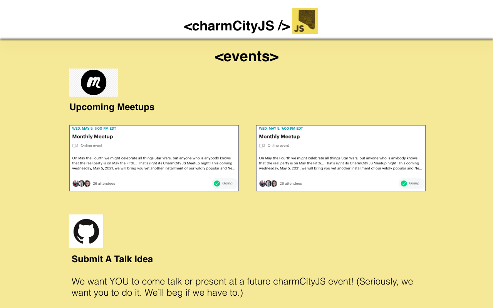

# charmCityJS Website Redesign

Redesign and update of www.charmcityjs.org, a javascript affinity group in Baltimore, MD. Building using html, css, and vanilla JS to support continued maintence in a volunteer-baised organization.

## Build Status

In review - [see it live](https://samanthasolomon.com/Charm-City-JS/)

## Design

Design goals included a clean and JS-themed look that drew on existing branding. Styling is kept simple for easy maintainability in a volunteer organization with developers of differing skill sets. Includes mobile, tablet, and desktop responsiveness.

### Architecture

### Wireframe Highlights

